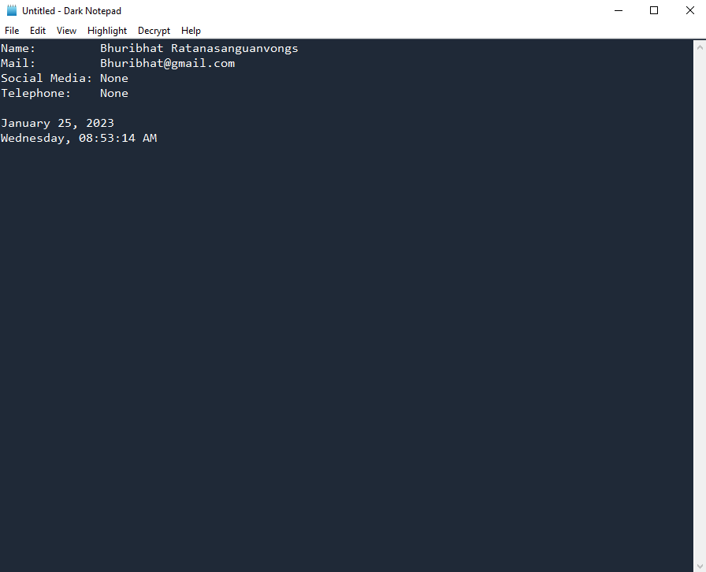
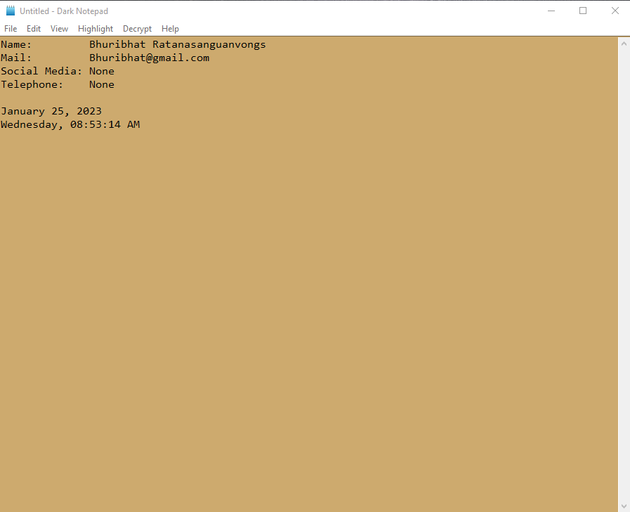
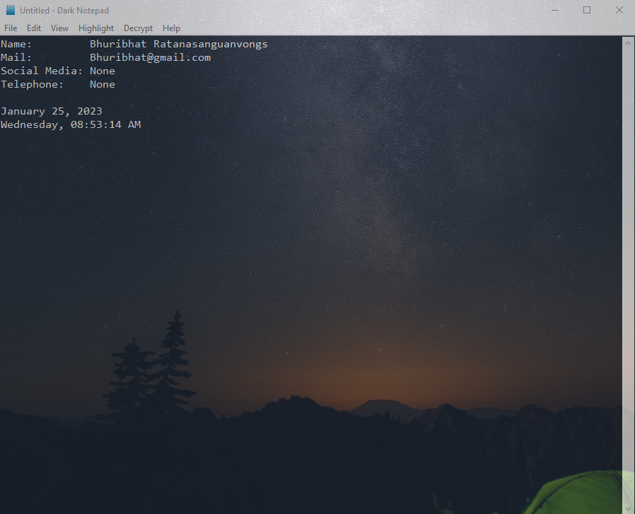

# Dark Notepad

Dark Notepad is a text editor, It can edit text files (bearing the ". txt" filename extension).  
It can create contract from user's information.

```
-n for name
-m for mail
-p for phone number
-s for social media
```

**usage**

```sh
>> py main.py -n name -m mail -p phone -s social
```

## Example

- Dark Theme


- Light Theme


- Transparent
